# Grama-Vasathi

**Empowering Rural Tourism through Trust and Transparency.**

Grama-Vasathi is a mobile platform designed to bridge the gap between rural Karnataka homestay hosts and urban travelers. It features a unique readiness score calculator to ensure quality standards, a seamless discovery system, and localized support to empower rural communities.

---

## 🚀 Key Features

- **Readiness Score Calculator:** A data-driven checklist for hosts to ensure their property meets safety and hygiene standards.
- **Experience-Based Discovery:** Guests can browse stays based on unique rural activities like organic farming, pottery, or trekking.
- **Bilingual Support:** Full support for English and Kannada to ensure accessibility for rural hosts.
- **Wishlist & Community Reviews:** Personalized saved lists and transparent peer-to-peer feedback systems.
- **Real-Time Synchronization:** Powered by Firebase for instant updates on listings and reviews.

---

## 🛠 Tech Stack

- **UI:** 100% Jetpack Compose
- **Backend:** Firebase (Firestore, Authentication, Storage)
- **Architecture:** MVVM (Model-View-ViewModel) + Clean Architecture
- **Dependency Injection:** Hilt
- **Navigation:** Jetpack Compose Navigation
- **Image Loading:** Coil
- **Local Language Support:** Android Localization (English & Kannada)

---

## 📋 In-Depth Workflows

### 🏡 Host Workflow (Property Management)
1.  **Registration & Listing:** Hosts register their property by adding names, descriptions, pricing, and high-quality images.
2.  **Activity Tagging:** Hosts select specific "Experience Tags" (e.g., Traditional Cooking) to help guests find their stay based on interests.
3.  **Quality Audit:** Using the **Readiness Checklist**, hosts verify safety and hygiene measures by marking items as *Done*, *Not Yet*, or *N/A*.
4.  **Readiness Scoring:** The system calculates a weighted score (0-100%) to provide a "Seal of Quality" for the listing.
5.  **Localized Management:** Hosts can manage their entire dashboard in **Kannada**, removing language barriers to digital business.

### 🎒 Guest Workflow (Traveler Journey)
1.  **Discovery:** Travelers browse a curated gallery of rural stays via property cards showing pricing and ratings.
2.  **Smart Filtering:** Guests use category chips to filter stays by specific rural activities or "vibes."
3.  **Property Evaluation:** Guests view deep-dive details, including host bios, amenities, and the property’s verified readiness score.
4.  **Wishlisting:** Save favorite properties to a personal list for future trip planning.
5.  **Feedback Loop:** After a stay, guests submit star ratings and text reviews to help build community trust.

---

## ⚙️ Setup Instructions

1.  **Clone the repository:**
    ```bash
    git clone https://github.com/yourname/gramavasathi.git
    ```
2.  **Open in Android Studio:** Open the project folder in Android Studio Ladybug or later.
3.  **Add Firebase:**
    - Create a project on the [Firebase Console](https://console.firebase.google.com/).
    - Add an Android app with package `com.yourname.gramavasathi`.
    - Download `google-services.json` and place it in the `app/` directory.
    - Enable **Firestore** and **Anonymous Authentication**.
4.  **Run the app:** Click the 'Run' button in Android Studio.

---

## 🧪 How to Seed Demo Data

1. Run the app in **Debug** mode.
2. Navigate to **Settings** (gear icon on Home screen).
3. Scroll to the bottom to find **Developer Options**.
4. Tap **"Seed Demo Data to Firestore"**. This will populate your database with 10 sample listings, reviews, and bookings.

---

## 📂 Module Structure

- `data/`: Firestore models, DTOs, and Repository implementations.
- `ui/`: Compose screens, reusable components, and theme definitions.
- `viewmodel/`: State management and business logic for all UI screens.
- `util/`: Helper classes, including the Score Calculator and Demo Data script.

---

## 📸 Screenshots

### Home and discovery
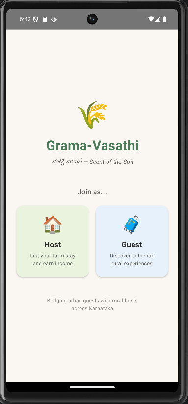
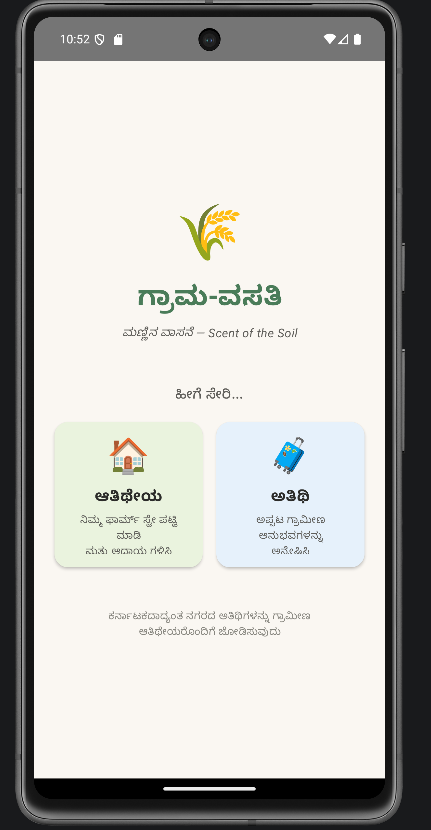
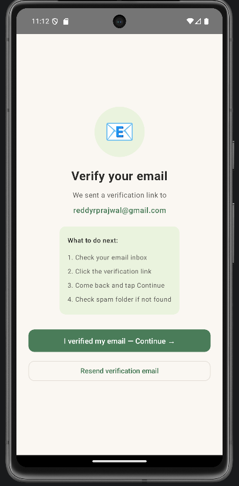

### Guest experience
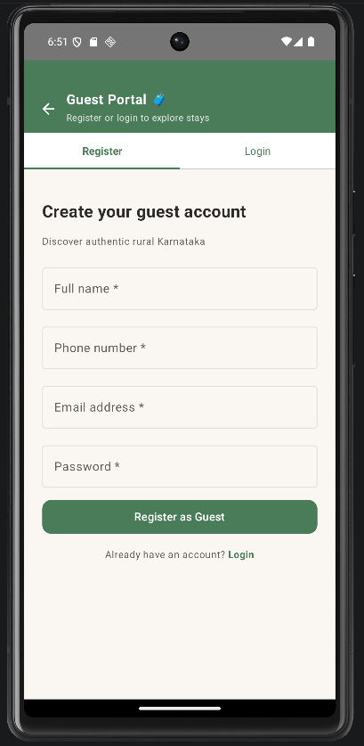
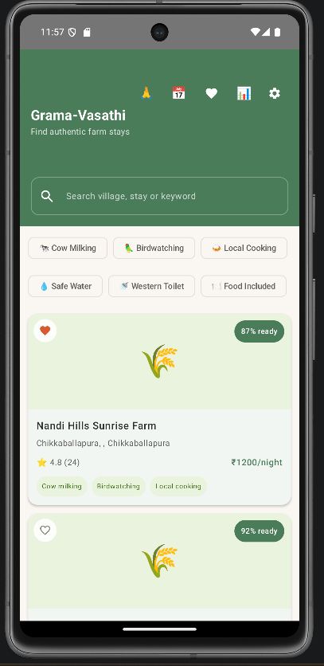
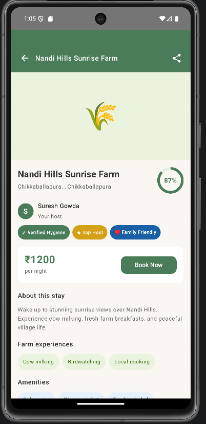
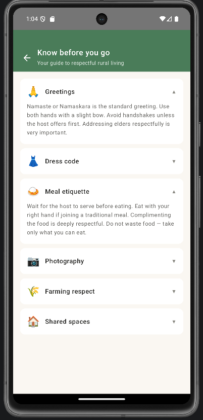
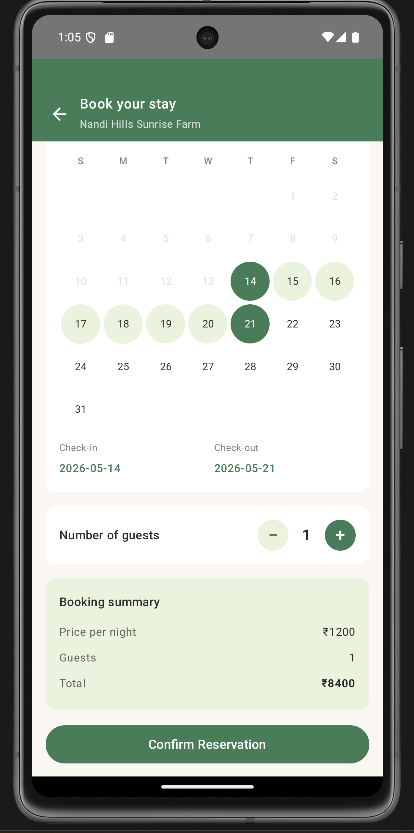
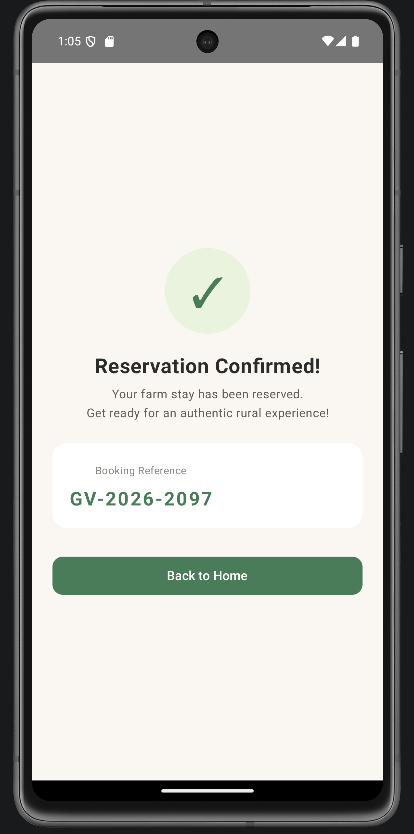
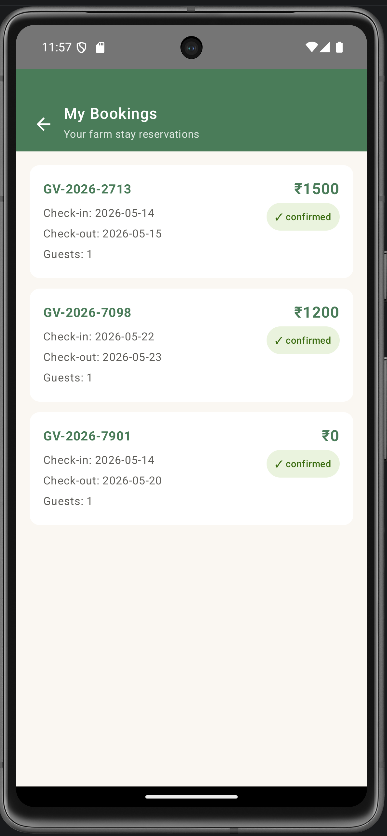
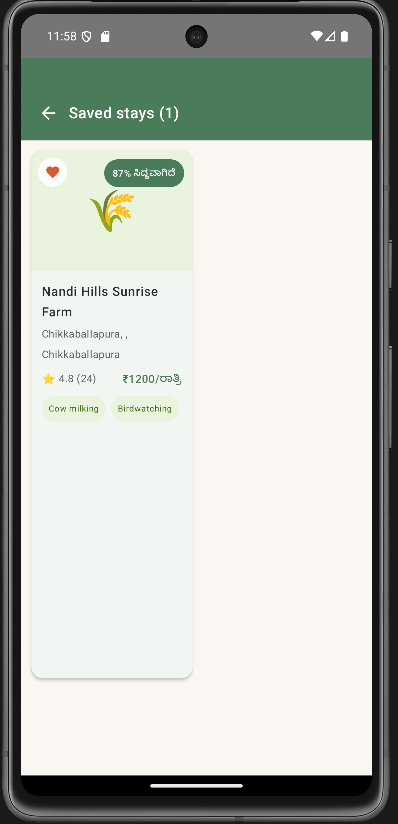
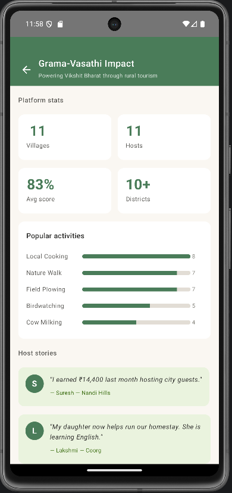

### Host experience
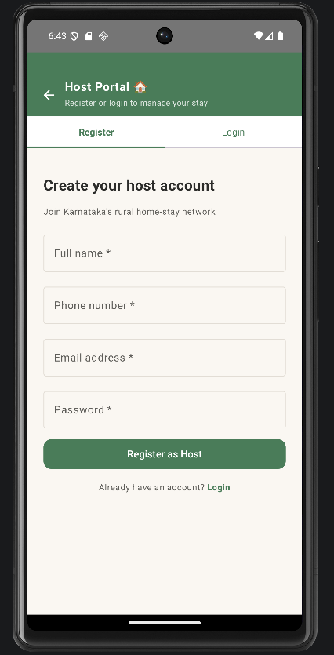
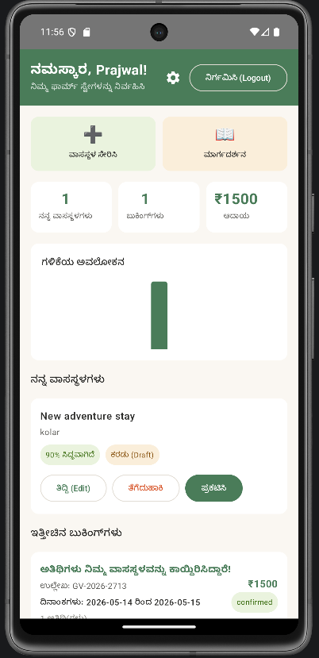
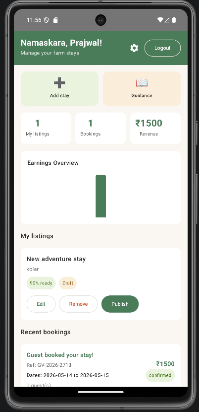
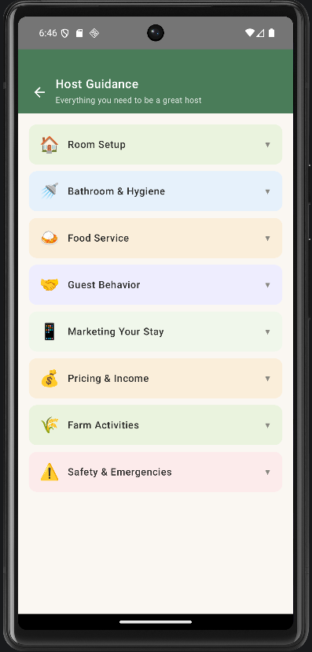
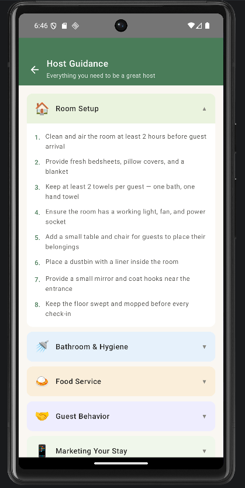
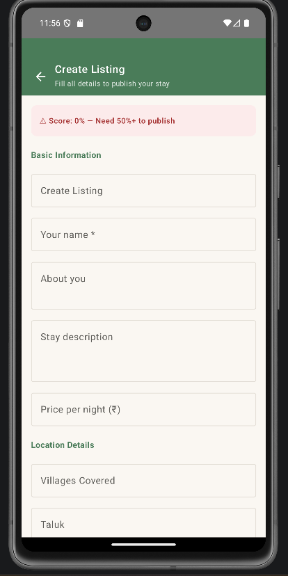
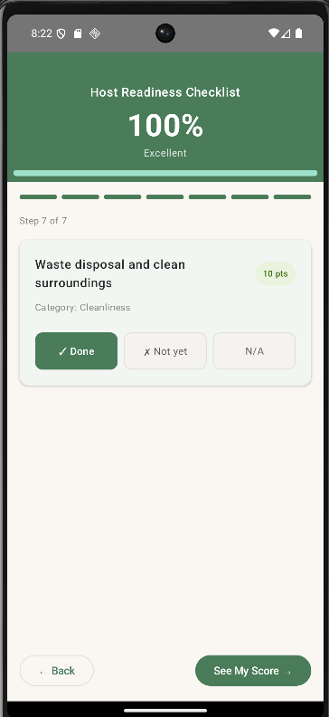
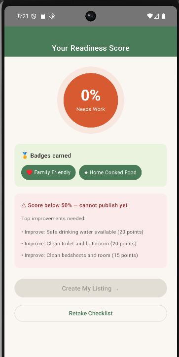
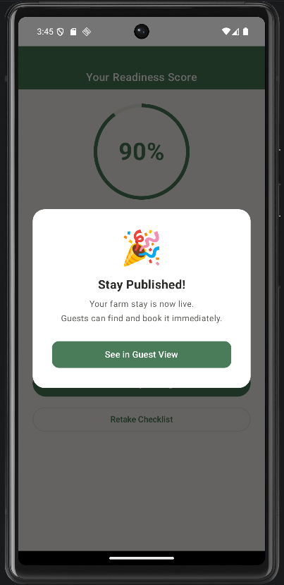

### Readiness and support
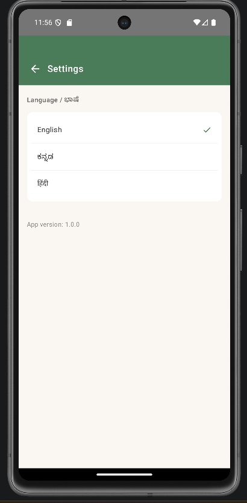


